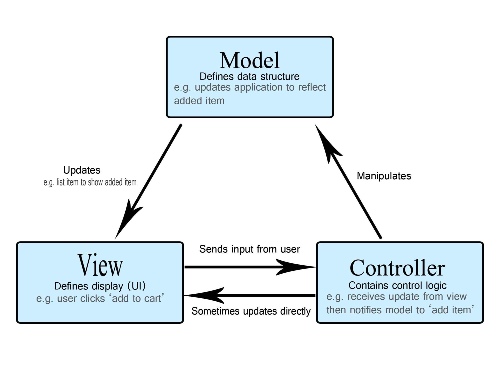

- [Programmazione ad oggetti](#programmazione-ad-oggetti)
  - [Introduzione](#introduzione)
  - [Classi e oggetti](#classi-e-oggetti)
  - [Principi fondamentali](#principi-fondamentali)
    - [Vantaggi della programmazione ad oggetti](#vantaggi-della-programmazione-ad-oggetti)
  - [Interfaccia Vs Classe Astratta](#interfaccia-vs-classe-astratta)
    - [Diamond Problem](#diamond-problem)
- [Passaggo di parametri](#passaggo-di-parametri)
- [Memoria](#memoria)
  - [Ricorsione vs Iterazione](#ricorsione-vs-iterazione)
- [Funzioni](#funzioni)
  - [Funzione pura](#funzione-pura)
  - [Funzioni idempotenti](#funzioni-idempotenti)
  - [Funzioni di ordine superiore (Higher-Order Functions)](#funzioni-di-ordine-superiore-higher-order-functions)
- [Architettura e design pattern](#architettura-e-design-pattern)
  - [Design pattern](#design-pattern)
    - [Pattern Singleton](#pattern-singleton)
    - [Pattern Factory](#pattern-factory)
    - [Pattern Repository](#pattern-repository)
    - [Pattern MVC](#pattern-mvc)
      - [Flusso delle Operazioni](#flusso-delle-operazioni)
    - [Pattern Observer](#pattern-observer)
    - [Pattern Strategy](#pattern-strategy)
- [Database](#database)
  - [Indici](#indici)
    - [Clustere e Un-Clustered](#clustere-e-un-clustered)
  - [Mappatura di ereditarietà - TPT, TPH, TPC](#mappatura-di-ereditarietà---tpt-tph-tpc)

# Programmazione ad oggetti

## Introduzione

La programmazione orientata ad oggetti (OOP - Object Oriented Programming) è un paradigma di programmazione che permette di modellare il mondo reale in modo più semplice e intuitivo.

In questo paradigma, i dati e le operazioni che possono essere eseguite su di essi sono raggruppati in un'unica entità chiamata **oggetto**.

## Classi e oggetti

Una classe è un modello che definisce le caratteristiche (**attributi**) e il comportamento (**metodi**) di un oggetto. Un oggetto è un'istanza di una classe.

```typescript
class Persona {
  private nome: string;
  private cognome: string;
  private eta: number;

  constructor(nome: string, cognome: string, eta: number) {
    this.nome = nome;
    this.cognome = cognome;
    this.eta = eta;
  }

  saluta() {
    console.log(`Ciao, mi chiamo ${this.nome} ${this.cognome}`);
  }
}
```

## Principi fondamentali

- **Ereditarietà**: permette di creare nuove classi basate su classi esistenti. La classe figlia eredita gli attributi e i metodi della classe padre, ciò favorisce il riutilizzo del codice.

```typescript
class Studente extends Persona {
  private matricola: string;

  constructor(nome: string, cognome: string, eta: number, matricola: string) {
    super(nome, cognome, eta);
    this.matricola = matricola;
  }

  studia() {
    console.log(`Lo studente ${this.nome} ${this.cognome} sta studiando`);
  }
}
```

- **Polimorfismo**: permette a oggetti di classi diverse di rispondere allo stesso messaggio in modi diversi.

```typescript
class Animale {
  muovi() {
    console.log("L'animale si muove");
  }
}

class Cane extends Animale {
  muovi() {
    console.log("Il cane cammina");
  }
}

class Pesce extends Animale {
  muovi() {
    console.log("Il pesce nuota");
  }
}
```

- **Incapsulamento**: nascondere i dettagli di implementazione di un oggetto e permettere l'accesso solo ai metodi pubblici.

```typescript
class ContoCorrente {
  private saldo: number;

  constructor(saldo: number) {
    this.saldo = saldo;
  }

  preleva(importo: number) {
    if (importo > this.saldo) {
      console.log("Saldo insufficiente");
      return;
    }

    this.saldo -= importo;
    console.log(`Hai prelevato ${importo} euro`);
  }

  deposita(importo: number) {
    this.saldo += importo;
    console.log(`Hai depositato ${importo} euro`);
  }

  getSaldo() {
    return this.saldo;
  }
}
```

- **Astrazione**: permette di definire un'interfaccia, firma, per un oggetto, nascondendo i dettagli di implementazione.

```typescript
abstract class Veicolo {
  protected marca: string;
  protected modello: string;

  constructor(marca: string, modello: string) {
    this.marca = marca;
    this.modello = modello;
  }

  public getInfo(): string {
    return `${this.marca} ${this.modello}`;
  }

  abstract avvia(): void;
}

class Auto extends Veicolo {
  private numeroPorte: number;

  constructor(marca: string, modello: string, numeroPorte: number) {
    super(marca, modello);
    this.numeroPorte = numeroPorte;
  }

  avvia(): void {
    console.log(`L'auto ${this.getInfo()} si è avviata con il motore`);
  }
}

// const veicolo = new Veicolo("Generic", "Vehicle"); // Errore!

const auto = new Auto("Fiat", "Panda", 5);
auto.avvia();
```

### Vantaggi della programmazione ad oggetti

- Codice più organizzato e modulare
- Maggiore riutilizzabilità
- Più facile da mantenere e modificare
- Migliore gestione della complessità

## Interfaccia Vs Classe Astratta

Le differenze chiave sono:

1. Implementazione dei metodi:
   1. Interfaccia: può contenere SOLO dichiarazioni, firma, di metodi (no implementazioni)
   2. Classe Astratta: può avere sia metodi astratti CHE metodi implementati
2. Accessibilità:
   1. Interfaccia: una classe può implementare MULTIPLE interfacce
   2. Classe Astratta: una classe può estendere UNA SOLA classe astratta. Questo per evitare il problema del diamante (diamond problem)
3. Ereditarietà
   1. Interfaccia: creando un interfaccia la classe può decidere se implementarlo o meno
   2. Classe Astratta: la classe DEVE implementare i metodi astratti della classe astratta (se ho 500 classi che estendono la classe astratta, devo implementare i metodi astratti in tutte le 500 classi)

### Diamond Problem

Il problema del diamante si verifica quando una classe eredita da due classi che a loro volta ereditano dalla stessa classe. Questo può causare ambiguità e problemi di implementazione.

Con `virtual` possiamo ottenere:

<div align="center">
     A<br>
    / &nbsp &nbsp &nbsp  \<br>
    B &nbsp &nbsp &nbsp  C<br>
    \ &nbsp &nbsp &nbsp  /<br>
     D
</div>

Senza `virtual`:

<div align="center">
    A &nbsp &nbsp &nbsp &nbsp  A<br>
    | &nbsp &nbsp &nbsp &nbsp  &nbsp |<br>
    B &nbsp &nbsp &nbsp &nbsp  C<br>
    \ &nbsp  &nbsp &nbsp &nbsp /<br>
     D

</div>

Alcuni linguaggi di programmazione, come `Java`, `typescript`, `C#`, risolvono il problema del diamante permettendo l'ereditarietà multipla solo per le interfacce.
**Una classe può implementare multiple interfacce ma estendere solo una classe astratta.**

In altri linguaggi, come `C++`, è possibile ereditare da più classi, ma bisogna fare attenzione a come si utilizzano le classi base.

Per questo motivo `C++` mette a disposizione la parola chiave `virtual` per risolvere il problema del diamante.

```cpp
class A {
public:
    A() { std::cout << "A::A()" << std::endl; }
};

class B : public A {
public:
    B(): A() { std::cout << "B::B()" << std::endl; }
};

class C : public A {
public:
    C(): A() { std::cout << "C::C()" << std::endl; }
};

class D : public B, public C {
public:
    D(): B(), C() { std::cout << "D::D()" << std::endl; }
};
```

output:

```plaintext
A::A()
B::B()
A::A()
C::C()
D::D()
```

La parola chiave `virtual` fa sì che: Venga creata una SOLA istanza della classe base (A) e che le classi derivate (B e C) condividano la stessa istanza della classe base.

```cpp

class A {
public:
    A() { std::cout << "A::A()" << std::endl; }
};

class B : virtual public A {
public:
    B(): A() { std::cout << "B::B()" << std::endl; }
};

class C : virtual public A {
public:
    C(): A() { std::cout << "C::C()" << std::endl; }
};

class D : public B, public C {
public:
    D() : B(), C(), A() { std::cout << "D::D()" << std::endl; }
};

```

output:

```plaintext
A::A()    // Costruttore di A chiamato una volta sola grazie a virtual
B::B()
C::C()
D::D()    // Costruttore di D
```

`class B : virtual public A ` Significa che ogni classe che eredita da B, è responsabile della creazione di A, in quanto B non lo fa in maniera automatica.

In generale, non è consentito chiamare direttamente il costruttore del parent, deve
essere chiamato tramite la classe genitore.

È consentito solo quando viene utilizzata la parola chiave "virtual".

# Passaggo di parametri

I parametri possono essere passati ai metodi in diversi modi:

- **By value**: il valore dell'argomento viene copiato nel parametro del metodo. Qualsiasi modifica al parametro all'interno del metodo non influisce sull'argomento originale.

```typescript
function incrementa(x: number) {
  x++;
}

let a = 10;
incrementa(a);
console.log(a); // 10
```

```cpp
void incrementa(int x) {
  x++;
}

int a = 10;
incrementa(a);

std::cout << a << std::endl; // 10
```

- **By reference**: il parametro del metodo contiene un riferimento all'argomento originale. Qualsiasi modifica al parametro all'interno del metodo influisce sull'argomento originale.

```typescript
function incrementa(x: { value: number }) {
  x.value++;
}

let a = { value: 10 };
incrementa(a);
console.log(a.value); // 11
```

```cpp
void incrementa(int& x) {
  x++;
}

int a = 10;
incrementa(a);
std::cout << a << std::endl; // 11
```

# Memoria

La divisione fondamentale della memoria di un qualsiasi computer è:

- `Stack`: contiene le variabili locali e i riferimenti ai metodi. È di dimensione fissa e viene liberata automaticamente quando la funzione termina.
- `Heap` contiene oggetti e variabili allocate dinamicamente. È di dimensione variabile e deve essere liberata manualmente o attraverso un garbage collector (vedi Java, C#).

## Ricorsione vs Iterazione

Con la **ricorsione** per ogni chiamata ricorsiva viene aggiunto un nuovo frame allo stack (parametri della funzione, indirizzo di ritorno, variabili locali).
Se la ricorsione è troppo profonda c'è un rischio di che si presenti l'errore di `stack overflow`, oltre al consumo eccessivo di memoria.

Con l'**iterazione** un singolo frame è sufficiente per eseguire l'intera funzione, inoltre le variabili locali e i parametri vengono riutilizzate.

# Funzioni

Una **procedura**, o **subroutine**, è una particolare tipo di funzione che non restituisce alcun valore.

Una **funzione** è un blocco di codice che esegue una specifica operazione. Prende in input dei **parametri** e restituisce un **valore di ritorno**.

```typescript
function somma(a: number, b: number): number {
  return a + b;
}
```

## Funzione pura

Le **funzioni pure** sono un sottoinsieme delle funzioni che aderiscono a due regole:

1. **Determinismo**: dati gli stessi input, una funzione pura produce sempre lo stesso output.
2. **Side-effect free**: una funzione pura non modifica lo stato del programma. Non interagisce con variabili globali, file, database o altri elementi esterni.

Ciò permette una maggiore facilità di test e di debug perché il loro comportamento dipende solo dagli input.

```typescript
function moltiplicaPerDue(x: number): number {
  return x * 2;
}
```

## Funzioni idempotenti

Le **funzioni idempotenti** sono funzioni che, **date le stesse condizioni iniziali**, restituiscono sempre lo stesso risultato.
Inoltre, l'applicazione ripetuta della funzione non modifica lo stato del sistema.

Es. una chiamata ad un database non è una funzione idempotente, perché il valore restituito può cambiare nel tempo.

## Funzioni di ordine superiore (Higher-Order Functions)

Si definisce **Higher-Order Functions** una funzione che accetta una o più funzioni come argomenti e/o restituisce una funzione.

```typescript
function customMap(a: number[], f: (x: number) => number): number[] {
  const result = [];

  for (let i = 0; i < a.length; i++) {
    result.push(f(a[i]));
  }

  return result;
}

const array = [1, 2, 3, 4, 5];
const quadrati = customMap(array, (x) => x * x);
```

# Architettura e design pattern

L'**architettura** è la struttura fondamentale di un sistema informatico che definisce:

- i componenti del sistema
- come questi componenti interagiscono tra loro
- come i dati vengono trasformati all'interno del sistema

Alcuni stili architetturali comuni sono:

1. `Client-Server`: separa il sistema client (che richiede il servizio) dal server (che fornisce il servizio)
2. `Layered`: suddivide il sistema in strati logici o fisici (es. frontend (presentation), backend (business logic), database (data))
3. `Microservices`: suddivide il sistema in servizi piccoli e indipendenti che comunicano tra loro attraverso API
4. `Event-Driven`: i componenti del sistema comunicano tra loro attraverso eventi
5. `Service-Oriented`: organizza il sistema in servizi che possono essere distribuiti, riusati e scalati

## Design pattern

I **design pattern** sono soluzioni generiche a problemi comuni che si presentano durante la progettazione del software. Questo porta numerosi vantaggi tra cui:

- riusabilità del codice
- facilità di manutenzione
- facilità di comprensione tra diversi sviluppatori

### Pattern Singleton

Il **pattern singleton** è un design pattern creazionale che garantisce che una classe abbia una sola istanza e fornisce un punto di accesso globale a tale istanza.

Infatti per realizzare questo pattern è necessario:

1. Dichiarare il **costruttore privato** o protetto in modo che non possa essere istanziato direttamente
2. Un punto di accesso globale alla classe tramite un **metodo statico** che restituisce l'istanza della classe, se non esiste la crea altrimenti restituisce l'istanza già esistente.
3. **Thread Safe** se l'applicazione è multithreaded è necessario gestire nel modo più opportuno la creazione dell'istanza (semafori, lock, mutex, ecc.)
4. **Lazy initialization** l'istanza viene creata solo al momento del bisogno.

Alcuni esempi di utilizzo di questo pattern sono: **logger** e **connessione al database**.

```typescript
class Singleton {
  private static instance: Singleton;

  private constructor() {}

  public static getInstance(): Singleton {
    if (!Singleton.instance) {
      Singleton.instance = new Singleton();
    }

    return Singleton.instance;
  }
}

const singleton = Singleton.getInstance();
```

```c#
public class Singleton
{
    private static Singleton instance;

    private Singleton() { }

    public static Singleton Instance
    {
        get
        {
            if (instance == null)
            {
                instance = new Singleton();
            }
            return instance;
        }
    }
}
```

### Pattern Factory

Il **pattern factory** è un design pattern creazionale che fornisce un'interfaccia per creare oggetti senza esporre la logica di creazione al client.

Esistono tre tipi di factory:

**Simple Factory**: una classe che ha il compito di creare oggetti di diverse classi. Usato quando si ha bisogno di diverse classi in modo semplice.

```typescript
interface Pizza {
  prepare(): void;
}

class Margherita implements Pizza {
  prepare() {
    console.log("Preparando Margherita");
  }
}

class Pepperoni implements Pizza {
  prepare() {
    console.log("Preparando Pepperoni");
  }
}

class SimplePizzaFactory {
  createPizza(type: string): Pizza {
    if (type === "margherita") return new Margherita();
    if (type === "pepperoni") return new Pepperoni();
    throw new Error("Pizza non disponibile");
  }
}
```

**Factory Method**: una classe astratta che definisce un metodo per creare oggetti, lasciando alle sottoclassi la responsabilità di implementare il metodo.
Questo pattern è molto flessibile e permette di creare oggetti di diverse classi.

Diverse filiali di pizzeria, ognuna con le sue specialità locali. Ogni filiale (sottoclasse) decide come preparare le sue pizze specifiche.

```typescript
abstract class PizzaStore {
  abstract createPizza(type: string): Pizza; // Factory method

  orderPizza(type: string): Pizza {
    const pizza = this.createPizza(type);
    pizza.prepare();
    return pizza;
  }
}

class ItalianPizzaStore extends PizzaStore {
  createPizza(type: string): Pizza {
    if (type === "margherita") return new ItalianStyleMargherita();
    // ... altre pizze italiane
  }
}

class AmericanPizzaStore extends PizzaStore {
  createPizza(type: string): Pizza {
    if (type === "pepperoni") return new AmericanStylePepperoni();
    // ... altre pizze americane
  }
}
```

**Abstract Factory**: una classe che fornisce un'interfaccia per creare famiglie di oggetti correlati o dipendenti senza specificarne le classi concrete.
Questo è il parttern più complesso.

Per esempio, un menu italiano completo (pizza + pasta + dessert) o un menu americano completo.

```typescript
interface PizzaIngredientFactory {
  createDough(): Dough;
  createSauce(): Sauce;
  createCheese(): Cheese;
}

class ItalianIngredientFactory implements PizzaIngredientFactory {
  createDough() {
    return new ThinCrustDough();
  }
  createSauce() {
    return new MarinaraSauce();
  }
  createCheese() {
    return new MozzarellaCheese();
  }
}

class AmericanIngredientFactory implements PizzaIngredientFactory {
  createDough() {
    return new ThickCrustDough();
  }
  createSauce() {
    return new TomatoSauce();
  }
  createCheese() {
    return new CheddarCheese();
  }
}
```

### Pattern Repository

Il **pattern repository** è un design pattern strutturale che astrae l'accesso ai dati, fornendo un'interfaccia per la comunicazione con il database.

```typescript
interface Repository<T> {
  findAll(): T[];
  findById(id: number): T | undefined;
  save(entity: T): void;
  update(entity: T): void;
  delete(entity: T): void;
}

class UserRepository implements Repository<User> {
  private users: User[] = []; // Simulazione di un database

  findAll(): User[] {
    return this.users;
  }

  findById(id: number): User | undefined {
    return this.users.find((user) => user.id === id);
  }

  save(user: User): void {
    this.users.push(user);
  }

  update(user: User): void {
    const index = this.users.findIndex((u) => u.id === user.id);
    if (index !== -1) {
      this.users[index] = user;
    }
  }

  delete(user: User): void {
    this.users = this.users.filter((u) => u.id !== user.id);
  }
}
```

### Pattern MVC

Il **Pattern MVC** divide l'applicazione in tre componenti principali, ognuno con responsabilità specifiche:

<div align="center">     

</div>

1. **Model**: rappresenta i dati e la logica di business dell'applicazione. È responsabile della gestione dei dati, della logica di business e delle regole dell'applicazione nonché della validazione dei dati.
   Comunica con il database se presente (CRUD).

1. **View**: Si occupa della presentazione dei dati e dell'interazione con l'utente, invia gli eventi dell'utente al controller.

1. **Controller**: Fa da intermediario tra Model e View, aggiorna il model in base alle azioni dell'utente e aggiorna la view in base allo stato del model.

#### Flusso delle Operazioni

1. L'utente interagisce con la View (es. clicca "Aggiungi")
1. La View notifica il Controller dell'evento
1. Il Controller elabora l'evento e chiama i metodi appropriati del Model
1. Il Model aggiorna i suoi dati
1. Il Controller riceve l'aggiornamento e dice alla View di aggiornarsi
1. La View si aggiorna mostrando i nuovi dati

### Pattern Observer

Il **pattern observer** è un design pattern comportamentale che definisce una dipendenza uno-a-molti tra oggetti in modo che quando un oggetto cambia stato, tutti i suoi dipendenti vengano notificati e aggiornati automaticamente.

I componenti principali sono:

- **Subject**: mantiene una lista di osservatori e notifica gli osservatori quando cambia il suo stato.
- **Observer**: fornisce un'interfaccia per la notifica degli eventi, normalmente questa è definito come un metodo `update` che viene chiamato dal Subject.

### Pattern Strategy

Il **pattern strategy** è un design pattern comportamentale che definisce una famiglia di algoritmi (strategie)intercambiabili tra loro e di incapsularli in classi separate. Questo pattern permette di variare l'algoritmo da utilizzare in fase di esecuzione, senza dover modificare il codice client che lo utilizza.

Esempio:

- **Modalità di pagamento**: In un'applicazione di e-commerce, puoi avere diverse strategie di pagamento (carta di credito, PayPal, bonifico bancario) e scegliere quella appropriata al momento del checkout.
- **Calcolo di commissioni**: Se devi calcolare commissioni in base a diversi fattori (tipo di cliente, importo dell'ordine, ecc.), puoi definire una strategia per ciascuna regola di calcolo.
- **Algoritmi di ordinamento**: Se devi ordinare una collezione di oggetti in modi diversi (per nome, per data, ecc.), puoi definire una strategia di ordinamento per ciascun criterio.

Per realizzarlo è necessario definire un'interfaccia comune per tutte le strategie e implementare ciascuna strategia in una classe separata.

```typescript
interface OrdinamentoStrategy {
  ordina(array: number[]): number[];
}

class OrdinamentoCrescente implements OrdinamentoStrategy {
  ordina(array: number[]): number[] {
    return array.sort((a, b) => a - b);
  }
}

class OrdinamentoDecrescente implements OrdinamentoStrategy {
  ordina(array: number[]): number[] {
    return array.sort((a, b) => b - a);
  }
}

class ContestoOrdinamento {
  private strategy: OrdinamentoStrategy;

  constructor(strategy: OrdinamentoStrategy) {
    this.strategy = strategy;
  }

  setStrategy(strategy: OrdinamentoStrategy): void {
    this.strategy = strategy;
  }

  eseguiOrdinamento(array: number[]): number[] {
    return this.strategy.ordina(array);
  }
}

const array = [5, 2, 8, 1, 9];
const contesto = new ContestoOrdinamento(new OrdinamentoCrescente());
console.log(contesto.eseguiOrdinamento(array)); // Output: [1, 2, 5, 8, 9]

contesto.setStrategy(new OrdinamentoDecrescente());
console.log(contesto.eseguiOrdinamento(array)); // Output: [9, 8, 5, 2, 1]
```

# Database

Un database è una raccolta organizzata di dati strutturati, memorizzati elettronicamente in un sistema informatico. I database sono progettati per archiviare, gestire e recuperare grandi quantità di informazioni in modo efficiente.

I principali tipi di database sono:

- **Relazionali**: i dati sono organizzati in tabelle con righe e colonne. Ogni tabella rappresenta un'entità e ogni riga rappresenta un record. I dati sono correlati tra loro attraverso **primary key** e **foreign key**.
  Esempi: MySQL, PostgreSQL, Oracle, SQL Server.

- **NoSQL**: i dati non sono organizzati in tabelle relazionali, ma in strutture più flessibili come documenti, colonne, grafi o coppie chiave-valore. Questi database sono progettati per gestire grandi quantità di dati non strutturati o semi-strutturati.

  - **Documentale**: i dati sono organizzati in documenti JSON o XML. Esempi: MongoDB, CouchDB.
  - **Colonne**: i dati sono organizzati in colonne piuttosto che righe. Esempi: Cassandra, HBase.
  - **Grafi**: i dati sono organizzati in nodi e archi. Esempi: Neo4j, Amazon Neptune.
  - **Chiave-valore**: i dati sono organizzati in coppie chiave-valore. Esempi: Redis, DynamoDB.

- **Orientati agli oggetti**: i dati sono organizzati in oggetti piuttosto che tabelle. Esempi: ObjectDB.

Alcune funzionalità dei database:

- **CRUD**: Create, Read, Update, Delete
- **Transazioni**: gruppo di operazioni atomiche che devono essere eseguite insieme o non affatto
- **Indici**: struttura dati che migliora le prestazioni delle query
- **Vincoli**: regole che limitano i dati che possono essere inseriti in una tabella
- **Trigger**: azioni automatiche eseguite in risposta a eventi specifici

Il **DBMS** (Database Management System) è il software che gestisce il database, fornisce un'interfaccia per l'utente e le applicazioni per accedere ai dati.

## Indici

Gli indici nei database sono strutture dati aggiuntive che migliorano significativamente le prestazioni delle query di ricerca.

Un indice è una struttura dati, simile a un dizionario, che memorizza i valori di una o più colonne specifica di una tabella. Questi valori sono ordinati in modo da consentire una ricerca rapida e efficiente.

Ovviamente con più dati si vogliono memorizzare negli indici e più spazio occupano, quindi è necessario trovare un giusto compromesso tra prestazioni e spazio.

Gli indici più comuni sono:

- `B-tree`: struttura ad albero bilanciato che memorizza i valori ordinati delle colonne. È adatto per le query di uguaglianza, intervallo e ordinamento.
- `Hash`: struttura hash che memorizza i valori delle colonne in una tabella hash. È adatto per le query di uguaglianza.

### Clustere e Un-Clustered

I **Clustere** e **Un-clustered** sono due tipi di indici che differiscono per il modo in cui i dati sono memorizzati e organizzati.

- **Clustered Index**: l'indice è organizzato in modo che le righe della tabella siano ordinate in base ai valori dell'indice. **Ogni tabella può avere un solo indice cluster**. Quando si crea un indice cluster, i dati della tabella vengono riorganizzati in base all'ordine dell'indice. Questo rende le query di ricerca più veloci, ma le operazioni di inserimento, aggiornamento e cancellazione più lente.

- **Un-Clustered Index**: l'indice è organizzato in modo separato dalla tabella. **Ogni tabella può avere più indici non cluster**. Gli indici non cluster contengono i valori dell'indice e un riferimento alla posizione della riga nella tabella. Questo rende le query di ricerca più lente rispetto agli indici cluster, ma le operazioni di inserimento, aggiornamento e cancellazione più veloci.

## Mappatura di ereditarietà - TPT, TPH, TPC

La **mappatura di ereditarietà** è il processo di mappare le classi e le relazioni di ereditarietà in un database relazionale.

Esistono tre strategie comuni per mappare l'ereditarietà in un database relazionale:

- **TPT (Table Per Type)**: ogni classe concreta ha la propria tabella. Le tabelle delle classi figlie contengono solo le colonne specifiche della classe figlia, oltre alle colonne ereditate dalla classe padre. Le tabelle delle classi figlie sono collegate alla tabella della classe padre tramite una relazione uno-a-uno.

```plaintext
Classi:
  Persona (id, nome)
  Studente (id, nome, matricola)
  Impiegato (id, nome, stipendio)

Tabelle:
  Persona (id, nome)
  Studente (id, matricola)  // id è FK a Persona
  Impiegato (id, stipendio) // id è FK a Persona

```

- **TPH (Table Per Hierarchy)**: tutte le classi concreti e astratte sono mappate nella stessa tabella. Una colonna discriminatoria (solitamente un tipo di stringa) viene utilizzata per distinguere tra le classi. Questa strategia è più semplice e veloce, ma può portare a tabelle con molte colonne vuote.

```plaintext
Classi:
  Persona (id, nome)
  Studente (id, nome, matricola)
  Impiegato (id, nome, stipendio)

Tabella:
  Persone (id, nome, matricola, stipendio, tipo)
```

- **TPC (Table Per Concrete)**: ogni classe concreta ha la propria tabella. Le tabelle delle classi figlie contengono tutte le colonne della classe padre e della classe figlia. Questa strategia è più complessa e richiede più join, ma evita colonne vuote.

```plaintext
Classi:
  Persona (id, nome)
  Studente (id, nome, matricola)
  Impiegato (id, nome, stipendio)

Tabelle:
  Studente (id, nome, matricola)
  Impiegato (id, nome, stipendio)
```
