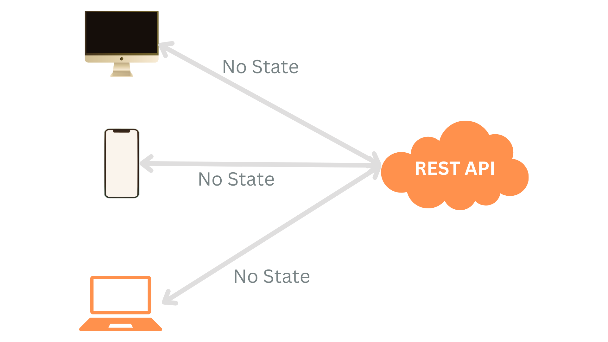
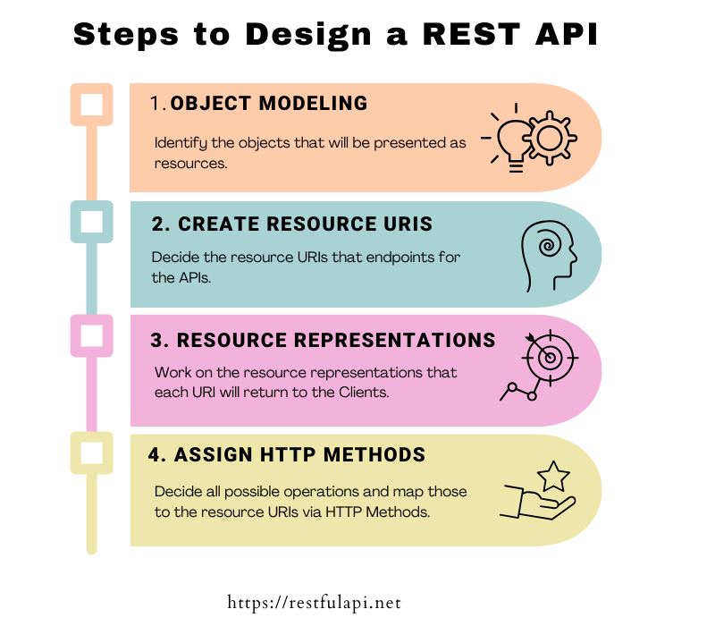

- [REST Api](#rest-api)
  - [I sei principi di REST](#i-sei-principi-di-rest)
    - [Cos'è una risorsa?](#cosè-una-risorsa)
- [HTTP Methods](#http-methods)
  - [HTTP GET](#http-get)
    - [Codici di risposta](#codici-di-risposta)
  - [HTTP POST](#http-post)
  - [HTTP PUT](#http-put)
  - [HTTP DELETE](#http-delete)
    - [Codici di risposta](#codici-di-risposta-1)
  - [HTTP PATCH](#http-patch)
- [Status Codes](#status-codes)
  - [1xx: Informational](#1xx-informational)
  - [2xx: Success](#2xx-success)
  - [3xx Redirection](#3xx-redirection)
  - [4xx Client ErrorStatus Code Description](#4xx-client-errorstatus-code-description)
  - [5xx Server Error](#5xx-server-error)
  - [HTTP REST codici di stato](#http-rest-codici-di-stato)
- [REST API URI convenzioni di denominazione e best practices](#rest-api-uri-convenzioni-di-denominazione-e-best-practices)
  - [1.1. Singleton o collezione di risorse](#11-singleton-o-collezione-di-risorse)
  - [1.2 Collezioni e sub-collezioni di risorse](#12-collezioni-e-sub-collezioni-di-risorse)
  - [Best Practices](#best-practices)
  - [Usa nomi per rappresentare le risorse](#usa-nomi-per-rappresentare-le-risorse)
  - [La consistenza è la chiave fondamentale](#la-consistenza-è-la-chiave-fondamentale)
    - [Usare / per indicare relazioni gerarchiche](#usare--per-indicare-relazioni-gerarchiche)
    - [NON usare / a fine URI](#non-usare--a-fine-uri)
    - [Usa - per migliorare la leggibilità degli URI](#usa---per-migliorare-la-leggibilità-degli-uri)
    - [NON usare \_](#non-usare-_)
    - [Usa lettere minuscole](#usa-lettere-minuscole)
  - [Non usare l'estensione di file](#non-usare-lestensione-di-file)
  - [Non usare le funzioni CRUD nel URI](#non-usare-le-funzioni-crud-nel-uri)
  - [Usa l'URI per filtrare i dati](#usa-luri-per-filtrare-i-dati)
  - [NON usare verbi nella URI](#non-usare-verbi-nella-uri)
- [API REST idempotente](#api-rest-idempotente)
  - [Idempotenza con HTTP](#idempotenza-con-http)
  - [Gestione delle operazioni non idempotenti](#gestione-delle-operazioni-non-idempotenti)
- [Versioning REST APIs](#versioning-rest-apis)
  - [Quando implementare una nuova versione?](#quando-implementare-una-nuova-versione)
  - [Come versionare REST API](#come-versionare-rest-api)
- [Statelessness in REST API](#statelessness-in-rest-api)
  - [Cos'è una stateless REST API?](#cosè-una-stateless-rest-api)
  - [Stato dell'applicazione vs. Stato delle risorse](#stato-dellapplicazione-vs-stato-delle-risorse)
  - [Vantaggi di utilizzare API REST stateless](#vantaggi-di-utilizzare-api-rest-stateless)
- [Design REST API](#design-rest-api)
  - [**Object modeling** - Identificare una risorsa](#object-modeling---identificare-una-risorsa)
  - [Creazione di modelli URI](#creazione-di-modelli-uri)
  - [Determinare la rappresentazione delle risorse](#determinare-la-rappresentazione-delle-risorse)
    - [Collezione di oggetti](#collezione-di-oggetti)
    - [Singolo device](#singolo-device)
  - [Ricapitolando](#ricapitolando)
  - [Assegnazione di metodi HTTP](#assegnazione-di-metodi-http)
    - [GET](#get)
      - [Sfogliare (browse) tutti i devices o collezioni](#sfogliare-browse-tutti-i-devices-o-collezioni)
      - [Sfogliare tutte le configurazioni di un dispositivo](#sfogliare-tutte-le-configurazioni-di-un-dispositivo)
      - [Sfogliare un singolo device o configurazione](#sfogliare-un-singolo-device-o-configurazione)
      - [Sfogliare una singola configurazione di un dispositivo](#sfogliare-una-singola-configurazione-di-un-dispositivo)
    - [POST](#post)
      - [Creare un nuovo device o configurazione](#creare-un-nuovo-device-o-configurazione)
    - [PUT](#put)
      - [Aggiornare un device o configurazione esistente](#aggiornare-un-device-o-configurazione-esistente)
    - [DELETE](#delete)
      - [Eliminare un device o configurazione](#eliminare-un-device-o-configurazione)
  - [Cosa fare dopo?](#cosa-fare-dopo)
- [REST API Best Practices](#rest-api-best-practices)
  - [Utilizzare convenzioni di denominazione e struttura degli URL coerenti](#utilizzare-convenzioni-di-denominazione-e-struttura-degli-url-coerenti)
  - [Usare HTTP methods correttamente](#usare-http-methods-correttamente)
  - [Statelessness is the Key](#statelessness-is-the-key)
  - [Utilizzare i codici di stato HTTP correttamente](#utilizzare-i-codici-di-stato-http-correttamente)
  - [Gestire il versionamento dell'API con cura](#gestire-il-versionamento-dellapi-con-cura)
  - [Garantire la retrocompatibilità](#garantire-la-retrocompatibilità)
  - [Limitazione della velocità del traffico per prevenire abusi](#limitazione-della-velocità-del-traffico-per-prevenire-abusi)
  - [Monitorare e registrare l'utilizzo delle API](#monitorare-e-registrare-lutilizzo-delle-api)
  - [Cache delle risposte per migliorare le prestazioni](#cache-delle-risposte-per-migliorare-le-prestazioni)
  - [Implementazione di filtri, ordinamenti e paginazione](#implementazione-di-filtri-ordinamenti-e-paginazione)
  - [Sicurezza](#sicurezza)
  - [Documentare le API REST](#documentare-le-api-rest)

# REST Api

REST è l'acronimo di **RE**presentational **S**tate **T**ransfer ed è un **insieme di principi architetturali** che definiscono come le risorse web dovrebbero essere definite e accessibili.
Durante il processo di sviluppo i programmatori possono adottare REST per creare le API.

> Un'API Web (o un servizio Web) che rispetta lo stile architetturale REST è chiamata API REST (o API RESTful).

## I sei principi di REST

1. **Uniform Interface**: definire un interfaccia uniforme e consistente per le interazioni tra client e server. (es. HTTP-Rest API usa GET, POST, PUT, DELETE ecc. e URI per l'identificazione delle risorse)

   - **Identificazione delle risorse**: Ogni risorsa deve essere identificata univocamente tramite un URI.
   - **Rappresentazione delle risorse**: Le risorse possono essere rappresentate in diversi formati (XML, JSON, HTML, ecc.).
   - **Manipolazione delle risorse tramite rappresentazioni**: Le rappresentazioni delle risorse devono contenere informazioni sufficienti per modificare o eliminare la risorsa stessa.
   - **Hypermedia come motore dello stato dell'applicazione (HATEOAS)**: Le rappresentazioni delle risorse devono contenere link ipertestuali per navigare tra le risorse.

2. **Client-Server**: Separare l'interfaccia utente dallo storage dei dati. Questo permette di migliorare la portabilità tra diverse piattaforme e di scalare il sistema in modo indipendente.

3. **Stateless**: Ogni richiesta da parte del client deve contenere tutte le informazioni necessarie per soddisfare la richiesta. Il server non deve mantenere alcuna informazione sullo stato del client.

4. **Cacheable**: Le risposte alle richieste devono essere esplicitamente contrassegnate come cacheable o non-cacheable. Questo permette ai client di memorizzare le risposte e di riutilizzarle per richieste future.

5. **Layered System**: Un client non deve essere in grado di distinguere se sta comunicando direttamente con il server finale o con un intermediario. Questo permette di scalare il sistema aggiungendo livelli intermedi.

6. **Code on Demand (optional)**: Il server può trasferire codice eseguibile al client per estendere le funzionalità del client stesso. Questo principio è opzionale e non è sempre necessario.

### Cos'è una risorsa?

Una risorsa è un concetto chiave in REST. Una risorsa è un oggetto o un **insieme di dati** che può essere **referenziato tramite un URI**.

Ad esempio, un'immagine, un file, un documento, un utente, ecc. possono essere considerati risorse. Le risorse possono essere **manipolate tramite rappresentazioni**.

Una rappresentazione è una forma di una risorsa in un formato specifico (es. **JSON**, **XML**, **HTML**, ecc.). Le rappresentazioni delle risorse possono essere trasferite tra client e server.

```json
{
  "id": 1,
  "name": "John Doe",
  "email": "..."
}
```

Lo stato di una risorsa è una terna di valori:

- I **dati** veri e propri
- I **metadati** che descrivono i dati (es. lunghezza, tipo, formato, ecc.)
- I **collegamenti ipertestuali** che permettono di navigare tra le risorse

# HTTP Methods

Le linee guida REST suggeriscono di usare specifiche chiamate HTTP ( GET, POST, DELETE, ecc. ) per eseguire operazioni su risorse. Queste chiamate sono chiamate **HTTP methods**.

## HTTP GET

Il metodo **GET** deve venire utilizzato solo per **RECUPERARE** informazioni dal server. Non deve avere effetti collaterali sul server.

Il metodo GET è **safe** e **idempotent**:

- **Safe**: Non modifica lo stato del server.
- **Idempotent**: Eseguire la stessa richiesta più volte produce lo stesso risultato (a patto che la base dati rimanga costante).

### Codici di risposta

- **200 OK**: La richiesta è stata completata con successo.
- **404 Not Found**: La risorsa richiesta non è stata trovata.
- **400 Bad Request**: La richiesta non è stata compresa dal server.

```http
HTTP GET http://www.appdomain.com/users
HTTP GET http://www.appdomain.com/users/123/address
```

## HTTP POST

Il metodo **POST** viene utilizzato per **CREARE** nuove risorse sul server. Se parlaimo di REST allora questo metodo deve creare una nuova risorsa dentro una collezione di risorse.

Il metodo POST nè **non è idempotente** nè **safe**.
Questo perchè invocare più volte la stessa richiesta può creare risorse duplicate.

```http
HTTP POST http://www.appdomain.com/users
```

## HTTP PUT

Il metodo **PUT** viene utilizzato per **AGGIORNARE INTERAMENTE** una risorsa esistente sul server. Se la risorsa non esiste, PUT può crearla.

Il metodo PUT è **idempotente** (produce lo stesso risultato chiamato più volte sulla stessa risorsa) ma **non safe** (modifica la base dati).

```http
HTTP PUT http://www.appdomain.com/users/123
```

> La differenza tra PUT e POST può essere osservata nella richiesta: PUT richiede l'URI della singola risorsa da aggiornare, mentre POST richiede l'URI della collezione di risorse in cui creare una nuova risorsa.

## HTTP DELETE

Il metodo **DELETE** viene utilizzato per **ELIMINARE** una risorsa esistente sul server, identificata dall'URI.

Il metodo DELETE è **idempotente** (produce lo stesso risultato chiamato più volte sulla stessa risorsa) ma **non safe** (modifica la base dati).

### Codici di risposta

- **200 OK**: La risorsa è stata eliminata con successo.
- **202 Accepted**: La richiesta è stata accettata per l'elaborazione, ma la risorsa non è stata eliminata.
- **204 No Content**: La risorsa è stata eliminata con successo, ma non c'è contenuto da restituire.
- **404 Not Found**: La risorsa richiesta non è stata trovata.

```http
HTTP DELETE http://www.appdomain.com/users/123
```

## HTTP PATCH

Il metodo **PATCH** viene utilizzato per **AGGIORNARE PARZIALMENTE** una risorsa esistente sul server. Il metodo PATCH è **idempotente** e **non safe**.

Non tutti i browser supportano PATCH.

```http
HTTP PATCH http://www.appdomain.com/users/123
[{ "op": "replace", "path": "/email", "value": "new.email@example.org" }]
```

Le operazioni possibili sono le seguenti, secondo le specifiche HTTP.

```json
[
  { "op": "test", "path": "/a/b/c", "value": "foo" },
  { "op": "remove", "path": "/a/b/c" },
  { "op": "add", "path": "/a/b/c", "value": ["foo", "bar"] },
  { "op": "replace", "path": "/a/b/c", "value": 42 },
  { "op": "move", "from": "/a/b/c", "path": "/a/b/d" },
  { "op": "copy", "from": "/a/b/d", "path": "/a/b/e" }
]
```

| HTTP   | Method                | CRUD Collection Resource (e.g. /users)                                                                  | Single Resouce (e.g. /users/123)                                                 |
| ------ | --------------------- | ------------------------------------------------------------------------------------------------------- | -------------------------------------------------------------------------------- |
| POST   | Create                | 201 (Created), ‘Location’ header with link to /users/{id} containing new ID                             | Avoid using POST on a single resource                                            |
| GET    | Read                  | 200 (OK), list of users. Use pagination, sorting, and filtering to navigate big lists                   | 200 (OK), single user. 404 (Not Found), if ID not found or invalid               |
| PUT    | Update/Replace        | 405 (Method not allowed), unless you want to update every resource in the entire collection of resource | 200 (OK) or 204 (No Content). Use 404 (Not Found), if ID is not found or invalid |
| PATCH  | Partial Update/Modify | 405 (Method not allowed), unless you want to modify the collection itself                               | 200 (OK) or 204 (No Content). Use 404 (Not Found), if ID is not found or invalid |
| DELETE | Delete                | 405 (Method not allowed), unless you want to delete the whole collection — use with caution             | 200 (OK). 404 (Not Found), if ID not found or invalid                            |

# Status Codes

Le specifiche HTTP definiscono questi codici di stato standard, suddivisi in cinque categorie, che possono essere utilizzati per comunicare i risultati della richiesta di un client.

- **1xx**: Informazioni - Richiesta ricevuta, il server continua con il processo.
- **2xx**: Successo - La richiesta è stata ricevuta, compresa e accettata con successo.
- **3xx**: Redirezione - Ulteriori azioni devono essere intraprese per completare la richiesta.
- **4xx**: Errore del cliente - La richiesta contiene sintassi errata o non può essere completata.
- **5xx**: Errore del server - Il server non è in grado di completare la richiesta a causa di un errore interno.

Alcuni dei codici di stato più comuni sono:

## 1xx: Informational

| Status       | Code Description                                                                                                                                                                                                                                                                                                                                                     |
| ------------ | -------------------------------------------------------------------------------------------------------------------------------------------------------------------------------------------------------------------------------------------------------------------------------------------------------------------------------------------------------------------- |
| 100 Continue | An interim response. Indicates to the client that the initial part of the request has been received and has not yet been rejected by the server. The client SHOULD continue by sending the remainder of the request or, if the request has already been completed, ignore this response. The server MUST send a final response after the request has been completed. |

## 2xx: Success

| Status                | Code Description                                                                                                                                                                                                                                                    |
| --------------------- | ------------------------------------------------------------------------------------------------------------------------------------------------------------------------------------------------------------------------------------------------------------------- |
| 200 OK                | Indicates that the request has succeeded.                                                                                                                                                                                                                           |
| 201 Created           | Indicates that the request has succeeded and a new resource has been created as a result.                                                                                                                                                                           |
| 202 Accepted          | Indicates that the request has been received but not completed yet. It is typically used in log running requests and batch processing.                                                                                                                              |
| 203 Non-Authoritative | Information Indicates that the returned metainformation in the entity header is not the definitive set as available from the origin server but is gathered from a local or third-party copy. The set presented MAY be a subset or superset of the original version. |
| 204 No Content        | The server has fulfilled the request but does not need to return a response body. The server may return the updated meta information.                                                                                                                               |
| 205 Reset Content     | Indicates the client to reset the document that sent this request.                                                                                                                                                                                                  |
| 206 Partial Content   | It is used when the Range header is sent from the client to request only part of a resource.                                                                                                                                                                        |

## 3xx Redirection

| Status Code           | Description                                                                                                                                                                                                          |
| --------------------- | -------------------------------------------------------------------------------------------------------------------------------------------------------------------------------------------------------------------- |
| 300 Multiple Choices  | The request has more than one possible response. The user-agent or user should choose one of them.                                                                                                                   |
| 301 Moved Permanently | The URL of the requested resource has been changed permanently. The new URL is given by the Location header field in the response. This response is cacheable unless indicated otherwise.                            |
| 302 Found             | The URL of the requested resource has been changed temporarily. The new URL is given by the Location field in the response. This response is only cacheable if indicated by a Cache-Control or Expires header field. |
| 303 See Other         | The response can be found under a different URI and SHOULD be retrieved using a GET method on that resource.                                                                                                         |
| 304 Not Modified      | Indicates the client that the response has not been modified, so the client can continue to use the same cached version of the response.                                                                             |

## 4xx Client ErrorStatus Code Description

| Status Code            | Description                                                                                                                                       |
| ---------------------- | ------------------------------------------------------------------------------------------------------------------------------------------------- |
| 400 Bad Request        | The server could not understand the request due to incorrect syntax. The client should NOT repeat the request without modifications.              |
| 401 Unauthorized       | Indicates that the request requires user authentication information. The client MAY repeat the request with a suitable Authorization header field |
| 403 Forbidden          | Unauthorized request. The client does not have access rights to the content. Unlike 401, the client’s identity is known to the server.            |
| 404 Not Found          | The server can not find the requested resource.                                                                                                   |
| 405 Method Not Allowed | The server knows the request HTTP method, but it has been disabled and cannot be used for that resource.                                          |

## 5xx Server Error

| Status Code               | Description                                                                                                     |
| ------------------------- | --------------------------------------------------------------------------------------------------------------- |
| 500 Internal Server Error | The server encountered an unexpected condition that prevented it from fulfilling the request.                   |
| 501 Not Implemented       | The HTTP method is not supported by the server and cannot be handled.                                           |
| 502 Bad Gateway           | The server got an invalid response while working as a gateway to get the response needed to handle the request. |
| 503 Service Unavailable   | The server is not ready to handle the request.                                                                  |
| 504 Gateway Timeout       | The server is acting as a gateway and cannot get a response in time for a request.                              |

## HTTP REST codici di stato

Codici di stato HTTP specifici per REST sono:

- **200 OK**: dovrebbe contenere il payload richiesto.
- **201 Created**: il server dovrebbe creare una risorsa prima di rispondere con questo codice, altrimenti dovrebbe restituire 202 Accepted.
- **204 No Content**: dovrebbe essere restituito quando non c'è contenuto da restituire.
- **301 Moved Permanently**: L'API REST deve specificare il nuovo URI nell'intestazione Location della risposta.
- **400 Bad Request**: dovrebbe essere restituito quando la richiesta non può essere elaborata a causa di errori di sintassi. Il client non dovrebbe ripetere la richiesta senza modifiche.
- **401 Unauthorized**: dovrebbe essere restituito quando l'utente non è autorizzato a eseguire l'operazione richiesta.
- **403 Forbidden**: dovrebbe essere restituito quando l'utente è autorizzato e autenticato, ma non ha i permessi necessari per eseguire l'operazione richiesta.
- **404 Not Found**: dovrebbe essere restituito quando la risorsa richiesta non è disponibile.

# REST API URI convenzioni di denominazione e best practices

## 1.1. Singleton o collezione di risorse

Le API REST dovrebbero utilizzare URI per identificare le [risorse](#cosè-una-risorsa). Le risorse possono essere identificate come **singleton** o **collezioni**.

- **Singleton**: Una risorsa singola è una risorsa che non ha sotto-risorse. Ad esempio, un'immagine, un file, un documento, un utente, ecc.
- **Collezione**: Una collezione di risorse è un insieme di risorse. Ad esempio, una lista di utenti, una lista di immagini, ecc.

```http
/customers			//is a collection resource
/customers/{id}		// is a singleton resource
```

## 1.2 Collezioni e sub-collezioni di risorse

Una risorsa può contenere altre risorse. Ad esempio, un utente può avere una lista di account, di indirizzi.

```http
/customers						//is a collection resource
/customers/{id}/accounts		// is a sub-collection resource
/customers/{id}/accounts/{accountId}	// is a singleton resource
```

REST API fanno largo uso delle URI (Uniform Resource Identifier) per identificare le risorse. Le URI dovrebbero essere **autoesplicative** e **facili da leggere**.

## Best Practices

## Usa nomi per rappresentare le risorse

Le **RESTful URI** dovrebbero far riferimento ad una cosa, nome, e non ad un'azione, verbo.

```http
/device-management/managed-devices
/device-management/managed-devices/{device-id}
/user-management/users
/user-management/users/{id}
```

Per una migliore chiarezza possiamo dividere le risorse in **singole risorse/Documenti**, **collezioni** **store**.

1. **Singole risorse/Documenti**: Le risorse che rappresentano un singolo oggetto dovrebbero essere identificate da un singolo nome al singolare.

```http
http://api.example.com/device-management/managed-devices/{device-id}
http://api.example.com/user-management/users/{id}
http://api.example.com/user-management/users/admin
```

2. **Collezioni**: Le risorse che rappresentano una collezione di oggetti dovrebbero essere identificate da un nome al plurale.

```http
/device-management/managed-devices
/user-management/users
/user-management/users/{id}/accounts
```

3. **Store**: Le risorse che rappresentano un negozio dovrebbero essere identificate da un nome al plurale.

```http
/song-management/users/{id}/playlists
```

## La consistenza è la chiave fondamentale

Utilizzare convenzioni di denominazione delle risorse e formattazione degli URI coerenti per ridurre al minimo le ambiguità e massimizzare la **leggibilità** e la **manutenibilità**.

È possibile implementare i seguenti suggerimenti di progettazione per ottenere coerenza:

### Usare / per indicare relazioni gerarchiche

```http
/device-management
/device-management/managed-devices
/device-management/managed-devices/{id}
/device-management/managed-devices/{id}/info
```

### NON usare / a fine URI

```http
http://api.example.com/device-management/managed-devices/
http://api.example.com/device-management/managed-devices        //MIGLIORE!
```

### Usa - per migliorare la leggibilità degli URI

```http
http://api.example.com/devicemanagement/manageddevices/
http://api.example.com/device-management/managed-devices 	//MIGLIORE!
```

### NON usare \_

```http
http://api.example.com/inventory-management/managed-entities/{id}/install-script-location  //Più leggibile

http://api.example.com/inventory-management/managedEntities/{id}/installScriptLocation  //Meno leggibile
```

### Usa lettere minuscole

```http
http://api.example.com/device-management/managed-devices
http://api.example.com/Device-Management/Managed-Devices  //NO!
```

## Non usare l'estensione di file

Le API RESTful dovrebbero evitare l'uso di estensioni di file nei URI, per comunicare il type della risorsa di deve preferire l'uso del `Content-Type` header.

```http
/device-management/managed-devices 	/*URI Corretta*/
/device-management/managed-devices.json 	/*URI Errata*/
```

## Non usare le funzioni CRUD nel URI

Non si dovrebbero usare gli URI per indicare una funzione CRUD.

Gli URI devono essere usati solo per identificare le risorse e non per eseguire azioni su di esse in modo univoco.

```http
HTTP GET /device-management/managed-devices
HTTP POST /device-management/managed-devices

HTTP GET /device-management/managed-devices/{id}
HTTP PUT /device-management/managed-devices/{id}
HTTP DELETE /device-management/managed-devices/{id}
```

## Usa l'URI per filtrare i dati

Spesso si incontrano requisiti che richiedono un insieme di risorse ordinate, filtrate o limitate in base a qualche attributo specifico della risorsa.

Per questi requisiti, non bisogna creare nuove API, ma abilitare le funzionalità di ordinamento, filtraggio e paginazione nelle API di raccolta delle risorse e passare i parametri di input come parametri di query.

```http
/device-management/managed-devices
/device-management/managed-devices?region=USA
/device-management/managed-devices?region=USA&brand=XYZ
/device-management/managed-devices?region=USA&brand=XYZ&sort=installation-date
```

## NON usare verbi nella URI

Non è corretto usare verbi nella URI, infatti le API RESTful dovrebbero usare nomi per rappresentare le risorse.

Se usiamo verbi nella URI, stiamo creano un'API RPC-like (Remote Procedure Call), non una vera API RESTful.

```http
/device-management/managed-devices/{id}/scripts/{id}/execute    //è RPC, e non REST
```

Se dobbiamo eseguire un'azione su una risorsa, dovremmo usare i metodi HTTP per eseguire l'azione.

```http
/device-management/managed-devices/{id}/scripts/{id}/execute	//NO!

/device-management/managed-devices/{id}/scripts/{id}/status		//POST request con action=execute
```

# API REST idempotente

Una API REST è **idempotente** se produce lo stesso risultato quando chiamata più volte con gli stessi parametri. Quindi il risultato rimane costante.

In aritmetica, aggiungere o togliere 0 da un numero non cambia il risultato. Questo è un esempio di idempotenza.

Dobbiamo considerare il fatto che il client può inviare più volte la stessa richiesta a causa di problemi di rete, timeout, ecc, dunque serve un approccio di **Tolleranza**.

Inoltre possono essere utilzzate per effettuare **caching** delle risposte.

## Idempotenza con HTTP

Se seguiamo i principi REST nella progettazione delle nostre API, avremo API REST automaticamente idempotenti per i metodi:

- GET,
- PUT,
- DELETE,
- HEAD,
- OPTIONS
- TRACE.

Solo le API `POST` e `PATCH` **non saranno idempotenti**.

<style>
r { background:rgb(235, 84, 67); padding: 0 5px; border-radius: 5px; color: black }
g { background:rgb(150, 231, 116); padding: 0 5px; border-radius: 5px; color: black }
</style>

<div align="center">

| HTTP methods | Idempotent | Safe       |
| ------------ | ---------- | ---------- |
| GET          | <g>Yes</g> | <g>Yes</g> |
| HEAD         | <g>Yes</g> | <g>Yes</g> |
| PUT          | <g>Yes</g> | <r>No</r>  |
| DELETE       | <g>Yes</g> | <r>No</r>  |
| PATCH        | <r>Yes</r> | <r>No</r>  |
| POST         | <r>No</r>  | <r>No</r>  |

</div>

Generalmente, ma non sempre, `POST`, chiamata N volte produce N oggetti lato server, e `PATCH` non sono idempotenti. Ma è possibile rendere queste API idempotenti, se progettate correttamente.

I metodi `GET` e `HEAD` metodi invece non hanno alcun effetto lato server, non hanno accesso in scrittura.

Il metodo `PUT` è idempotente, poiché aggiornare un oggetto con lo stesso contenuto non cambia il risultato, lo sovrascrie.

Il metodo `DELETE` è idempotente, poiché eliminare un oggetto due volte non cambia il risultato, cambia il valore di ritorno (200 OK, 404 Not Found).

> Da notare che questo metodo può non essere più idempotente nel caso di eliminazione per esempio dell'ultimo elemento inserito (DELETE /item/last). Soluzione: Usare POST.

## Gestione delle operazioni non idempotenti

Un operazione che deve essere gestita in modo non idempotente è la **creazione di un nuovo account**, o altri tipi di risorse che devono essere **uniche**.

Per fare ciò possiamo utilizzare **token** che identifica la richiesta, e che può essere utilizzato per evitare duplicati e/o meccanismi di transazione.

# Versioning REST APIs

Le API RESTful dovrebbero essere progettate per essere **versionate**. La versione delle API è importante per garantire che le modifiche apportate alle API non interrompano le applicazioni client esistenti.

## Quando implementare una nuova versione?

- **Quando si cambia il formato della risposta**: Nuovi campi, campi obbligatori, campi opzionali, ecc.
- **Quando si cambia il formato della richiesta**: da intero --> float
- **Quando si rimuove una qualsiasi parte della API**

> Grandi cambiamenti dovrebbero essere gestiti con una nuova versione, mentre piccoli cambiamenti possono essere gestiti con la stessa versione (es. aggiunta di nuovi endpoint).

## Come versionare REST API

Ci sono diversi modi per versionare le API REST:

1. **URI versioning**: Includere la versione nella URI. Il più semplice e il più utilizzato.

   ```http

   http://api.example.com/v1/users
   https://api.stripe.com/v1/charges
   https://graph.facebook.com/v10.0/me
   https://api.github.com/v3/repos/{owner}/{repo}

   ```

2. **Custom Request Header**: Includere la versione come header personalizzato. Questo permette di mantenere l'URI pulita. (Non è un approccio standard)

   ```http
   X-API-Version: 2
   ```

3. **Usare "Accept" header**: Includere la versione come parte dell'intestazione Accept.

   ```http
   Accept: application/vnd.myapi.v1+json
   ```

# Statelessness in REST API

Lo **Stateless** è uno dei principi fondamentali di REST. Significa che ogni richiesta HTTP deve contenere tutte le informazioni necessarie per soddisfare la richiesta e dunque il server non deve mantenere **NESSUNA** informazione dei client e deve trattare ogni richiesta come se fosse la prima (nuova).

<div align="center">     

</div>

## Cos'è una stateless REST API?

Significa aderire ai principi di stateless: **il client deve inviare tutte le informazioni necessarie per soddisfare la richiesta**.

Inoltre il client è RESPONSABILE per la memorizzazione e gestione delle informazioni relative alla sessione.

Per consentire ai client di accedere a queste API stateless, è necessario che i server includano anche tutte le informazioni di cui il client potrebbe aver bisogno per creare/mantenere lo stato sul proprio lato.

## Stato dell'applicazione vs. Stato delle risorse

- **Stato dell'applicazione**: Si riferisce allo stato dell'applicazione lato server. Ad esempio, le sessioni utente, i cookie, ecc.

- **Stato delle risorse**: Si riferisce allo stato delle risorse lato server. Ad esempio, i dati delle risorse, i metadati, ecc.

## Vantaggi di utilizzare API REST stateless

- **Scalabilità**: Poiché non c'è stato da mantenere, i server possono gestire più richieste simultaneamente e servire migliaia di clienti.
- **Affidabilità**: Poiché non c'è stato da mantenere, non c'è bisogno di gestire problemi di sincronizzazione dello stato.
- **Semplicità**: Poiché non c'è stato da mantenere, le API REST stateless sono più semplici da progettare, implementare e testare.
- **Easy to cache**: Poiché le API REST stateless non mantengono lo stato, le risposte possono essere facilmente memorizzate nella cache.
- **Tracciabilità**: Il server non perde mai la traccia di "dove" si trova ogni client nell'applicazione, perché il client invia tutte le informazioni necessarie a ogni richiesta.

# Design REST API



Studiare teoricamente questi punti è una cosa, applicarli nella vita reale è tutt'altro caompionato. Ma vediamo alcuni consigli per progettare API REST:

## **Object modeling** - Identificare una risorsa

Il primo passo per progettare una API REST è identificare le risorse. Una risorsa è un oggetto o un insieme di dati che può essere referenziato tramite un URI.

> Ogni risorsa è identificata da un numero intero univoco: `id`.

Ad esempio, un'immagine, un file, un documento, un utente, un devicem una configurazione, ecc. possono essere considerati risorse.

## Creazione di modelli URI

Ora che il modello di oggetti è stato identificato, è il momento di creare la URI per identificare la risorsa.

**Queste URI sono gli endpoint della nostra API**.

```http
/devices
/devices/{id}

/configurations
/configurations/{id}

/devices/{id}/configurations
/devices/{id}/configurations/{configId}
```

Le URI dovrebbero essere **autoesplicative** e **facili da leggere**.
`NON DEVONO contenere verbi o azioni/operazioni`.

## Determinare la rappresentazione delle risorse

Ora che anche le URI sono state identificate, è il momento di determinare come rappresentare le risorse.

Le risorse possono essere rappresentate in diversi formati (`XML`, `JSON`, `HTML`, ecc.).

```json
{
  "id": 1,
  "name": "John Doe",
  "email": "..."
}
```

### Collezione di oggetti

Quando si cerca di ritornare una collezione di oggetti, si devono includere solo le informazioni **più importanti** riguardanti la risorsa, in modo tale da mantenere il **payload leggero e veloce**, migliorando le **performance** delle API.

```json
{
  "devices": [
    {
      "id": 1,
      "name": "Device 1",
      "status": "active"
    },
    {
      "id": 2,
      "name": "Device 2",
      "status": "inactive"
    }
  ]
}
```

### Singolo device

Al lato opporto della collezione troviamo il singolo oggetto, questa URI deve **restituire tutte le informazioni** relative all'oggetto richiesto.

Questo significa che deve includere liste di link ad altre sotto risorse e a tutte le altre operazioni supportate.

## Ricapitolando

- Le URI sono formate da solo **nomi**
- Sono di due forme: **singole** e **collezioni**
- Le collezioni sono di due tipi:
  - Collezione primaria
  - Collezione secondaria: è solo una sottocollezione di una collezione primaria.
- Ogni **risorsa** e **collezione** deve contenere almeno un link, es. `self`.
- Le collezioni contengono solo le più **importanti informazioni** delle risorse.
- Per avere tutte le informazioni di una risorsa, si deve accedere manualmente alla risorsa tramite URI.
- La rappresentazione piò avere dei link extra.
- **Non usare verbi** nelle URI.

Non abbiamo ancora parlato delle operazioni di queste risorse.

## Assegnazione di metodi HTTP

Ora che abbiamo identificato le risorse e le URI, è il momento di assegnare i metodi HTTP alle risorse.

Per esempio una risorsa puù essere:

- Creata (`create`)
- Aggioranta (`update`)
- Eliminata (`delete`)

### GET

#### Sfogliare (browse) tutti i devices o collezioni

```http
GET /devices
GET /configurations
```

Se la collezione è molto grande, possiamo applicare una paginaizone ed eventuali filtri.

```http
GET /devices?startIndex=0&size=2
GET /devices?status=active
GET /configurations?startIndex=0&size=20
```

#### Sfogliare tutte le configurazioni di un dispositivo

```http
GET /devices/{id}/configurations
```

#### Sfogliare un singolo device o configurazione

```http
GET /devices/{id}
GET /configurations/{id}
```

#### Sfogliare una singola configurazione di un dispositivo

```http
GET /devices/{id}/configurations/{configId}
```

### POST

#### Creare un nuovo device o configurazione

La creazione non è `idempotente`, quindi usiamo `POST`.

```http
POST /devices
POST /configurations
```

La richiesta **NON contiene nessun ID**, è il server si occuperà di generare un ID univoco.

### PUT

#### Aggiornare un device o configurazione esistente

L'operazione di aggiornamento è `idempotente`, quindi usiamo `PUT`.

```http
PUT /devices/{id}
PUT /configurations/{id}
PUT /devices/{id}/configurations
```

### DELETE

#### Eliminare un device o configurazione

```http
DELETE /devices/{id}
DELETE /configurations/{id}
DELETE /devices/{id}/configurations/{configId}
```

## Cosa fare dopo?

Fino ad ora abbiamo disegnato i modelli degli oggetti, le URI e assegnato i metodi HTTP alle risorse od operazioni su queste risorse.

È necessario lavorare anche su altri aspetti dell'applicazione:

- **Autenticazione e autorizzazione**: Come gestire l'autenticazione e l'autorizzazione degli utenti.
- **Gestione degli errori**: Come gestire gli errori e restituire i codici di stato appropriati.
- **Documentazione**: Come documentare le API REST per i client.
- ecc.

# REST API Best Practices

La guida delle Best Practices per le API REST aiuta nel costruire API senza tempo che siano `scalabili`, `sicure`, `efficienti` e che si integrino perfettamente con altri sistemi.

## Utilizzare convenzioni di denominazione e struttura degli URL coerenti

Dalla [RFC 3986](https://datatracker.ietf.org/doc/html/rfc3986) possiamo estrapolare alcune linee guida per la progettazione delle URL:

La struttura della URI dovrebbe riflettere la logica di relazione tra le risorse che rappresenta.

I **percorsi gerarchici** (es: `/users/{userId}/orders`) aiutano a organizzare le risorse in modo logico.

```http
GET /users/{userId}/orders/{orderId}  // Consigliato

GET /orders/{orderId}?userId=123     // Da evitare
```

I caratteri riservati quali `/`, `?`, `&`, `=`, `+`, ecc. dovrebbero essere usati solo per il loro scopo specifico.

```http
// Correct use of '/' to denote hierarchical relationships:
GET /users/123/orders/456
POST /books/789/reviews

// Correct use of '?' to specify query parameters:
GET /products?category=electronics&sort=price_desc

// Correct use of '#' for fragment identifiers:
GET /documentation#section2
```

Inoltre usare **lettere minuscole** e **trattini** per separare le parole. **Evitare** di usare **underscore**.

```http
GET /categories/technology    // Utilizza questo

GET /Categories/Technology   // NON USARE questo
```

## Usare HTTP methods correttamente

[RFC 7231](https://datatracker.ietf.org/doc/html/rfc7231) e RFC [9110](https://www.rfc-editor.org/rfc/rfc9110.html) definiscono e discutono chiaramente l'uso corretto dei metodi HTTP.

Parlando inoltre di **idempotenza**, **cacheability** e **sicurezza** dei metodi HTTP.

Ricordiamo che:

- Un metodo è **idempotente** se il risultato è lo stesso quando chiamato più volte. (GET, PUT, DELETE)
- Un metodo è **safe** se non modifica lo stato del server. (GET, HEAD)
- Un metodo è **cacheable** se la risposta può essere memorizzata nella cache. (GET, HEAD)

<div align="center">

| HTTP methods | comportamento                                           | Idempotente | Safe | Cacheable |
| ------------ | ------------------------------------------------------- | ----------- | ---- | --------- |
| GET          | Recupera le informazioni                                | ✅          | ✅   | ✅        |
| POST         | Crea una nuova risorsa                                  | ❌          | ❌   | ❌        |
| PUT          | Aggiorna **INTERAMENTE** una risorsa esistente          | ✅          | ❌   | ❌        |
| PATCH        | Aggiorna **PARZIALMENTE** una risorsa esistente         | ✅          | ❌   | ❌        |
| DELETE       | Elimina una risorsa esistente                           | ✅          | ❌   | ❌        |
| HEAD         | Recupera le informazioni sull'header                    | ✅          | ✅   | ✅        |
| OPTIONS      | Recupera le informazioni sulle opzioni di comunicazione | ✅          | ✅   | ❌        |
| CONNECT      | Stabilisce un tunnel per il server                      | ✅          | ❌   | ❌        |

</div>

## Statelessness is the Key

Il concetto di **statelessness** ha origine dal principio di **architettura REST** delineate da [Roy Fielding](https://ics.uci.edu/~fielding/pubs/dissertation/top.htm).

**Stateless** significa che ogni richiesta HTTP deve contenere tutte le informazioni necessarie per soddisfare la richiesta e il server non deve mantenere alcuna informazione sul client.

Questo permette di **scalare agilmente**, **migliorare la sicurezza**, **ridurre la complessità** e **affidabilità**.

## Utilizzare i codici di stato HTTP correttamente

Per esempio un codice di stato `200 OK` indica che la richiesta è stata completata con successo, mentre un codice di stato `404 Not Found` indica che la risorsa richiesta non è stata trovata.

La seguente tabella mostra i principali e più utilizzati codici di stato HTTP:

<div align="center">

| Categoria          | Range | Descrizione                                                                                  | Esempio                                                                           |
| ------------------ | ----- | -------------------------------------------------------------------------------------------- | --------------------------------------------------------------------------------- |
| Informativo        | 1xx   | Indica che la richiesta è stata ricevuta ed è in fase di elaborazione.                       | - 100 Continue <br> - 101 Switching Protocols                                     |
| Successo           | 2xx   | Indica che la richiesta è stata ricevuta, compresa e accettata con successo.                 | - 200 OK <br> - 201 Created <br> - 204 No Content                                 |
| Redirezione        | 3xx   | Indica che ulteriori azioni devono essere intraprese per completare la richiesta.            | - 301 Moved Permanently <br> - 302 Found <br> - 304 Not Modified                  |
| Errore del cliente | 4xx   | Indica che la richiesta contiene sintassi errata o non può essere completata.                | - 400 Bad Request <br> - 401 Unauthorized <br> - 404 Not Found                    |
| Errore del server  | 5xx   | Indica che il server non è in grado di completare la richiesta a causa di un errore interno. | - 500 Internal Server Error <br> - 502 Bad Gateway <br> - 503 Service Unavailable |

</div>

## Gestire il versionamento dell'API con cura

Il **versionamento** delle API è un modo per garantire che le modifiche apportate alle API non interrompano le compatibilità con le versioni precedenti.

Molti approcci possono essere utilizzati per versionare le API REST, tra cui:

<div align="center">

| Approccio di versionamento | Descrizione                                                                                                                                                                                                                                                                    | Esempio                                        |
| -------------------------- | ------------------------------------------------------------------------------------------------------------------------------------------------------------------------------------------------------------------------------------------------------------------------------ | ---------------------------------------------- |
| URI versioning             | Includere il numero di versione nell'URI. Questo approccio fornisce una chiara ed esplicita definizione delle versioni e semplifica le richieste dei client. Tuttavia, può portare a un'abbondanza di URI e può richiedere modifiche agli URI esistenti per le nuove versioni. | `/api/v1/resources`                            |
| Header Versioning          | Utilizzando un'intestazione personalizzata per indicare la versione desiderata. Questo approccio richiede ai clienti di gestire le intestazioni e può essere meno intuitivo per chi non ha familiarità con la manipolazione delle intestazioni.                                | `X-API-Version: 1`                             |
| Content Negotiation        | Consentire ai client di specificare la versione nell'intestazione **Accept**. In questo approccio, i client devono capire come utilizzare efficacemente la negoziazione dei contenuti.                                                                                         | Accept: <br> `application/vnd.example.v1+json` |

</div>

## Garantire la retrocompatibilità

La **retrocompatibilità**, è relazionato molto con il **versionamento** delle API.

Versioniamo le API per aggiornarle con nuove funzionalità e miglioramenti, ma dobbiamo garantire che le versioni precedenti continuino a funzionare senza problemi.

Un verionamento non ottimale può portare a `Version look` e/o `Version promiscuity`.

- **Version look**: si verifica quando il versioning di un'API è troppo rigido, tanto che i client devono utilizzare una versione specifica dell'API senza la possibilità di passare facilmente a versioni più recenti.
- **Version promiscuity**: si verifica quando il versioning di un'API è troppo flessibile, tanto che i client possono continuare a utilizzare versioni obsolete dell'API senza alcuna pressione per passare a versioni più recenti.

Per evitare questi problemi, si possono seguire le seguenti guidelines:

- `Deprecazione`: Indicare chiaramente una timeline di deprecazione per le versioni precedenti, con relativa documentazione.
- `Compatibilità`: Assicurare la compatibilità tra vecchi e nuovi endpoint.
- `Documentazione`: Documentare chiaramente le modifiche apportate alle nuove versioni. [Microsoft REST API Guidelines](https://learn.microsoft.com/en-us/azure/architecture/best-practices/api-design).

## Limitazione della velocità del traffico per prevenire abusi

Le API REST possono essere soggette a abusi quali:

- **DoS**: Denial of Service
- **Brute force attacks**: Tentativi di accesso non autorizzati
- **Resource Exhaustion**: La limitazione della velocità aiuta a garantire che tutti i client abbiano un accesso equo alle risorse limitate del server. In questo modo si evita che un singolo client le monopolizzi.

Varie strategia per limitare le risorse possono essere:

<div align="center">

| Rate Limiting Strategy      | Descrizion                                                                                                                                                                         | Esempio                                                                                                                                                                                      |
| --------------------------- | ---------------------------------------------------------------------------------------------------------------------------------------------------------------------------------- | -------------------------------------------------------------------------------------------------------------------------------------------------------------------------------------------- |
| **Fixed Window**            | È consentito solo un numero fisso di richieste in un determinato arco di tempo. Dopo tale periodo, il conteggio si azzera.                                                         | Consente 100 richieste al minuto. Se un client supera questo limite, ulteriori richieste vengono respinte fino all'inizio del minuto successivo.                                             |
| **Sliding Window**          | Gestire le richieste API monitorando continuamente gli ultimi N secondi/minuti di richieste, invece di resettare a intervalli fissi.                                               | Consentire agli utenti di effettuare 15 richieste ogni 10 minuti. Invece di un hard reset allo scadere dei 10 minuti, l'API tiene traccia delle richieste nell'ultima finestra di 10 minuti. |
| **Token Bucket**            | Ai clienti vengono assegnati dei token che rappresentano il numero di richieste consentite. Ogni richiesta consuma un token e i token vengono reintegrati a un ritmo prestabilito. | Un cliente inizia con 10 gettoni e può richiedere altri gettoni alla velocità di 1 gettone al secondo.                                                                                       |
| **Limitare la concorrenza** | Impedisce l'esecuzione dei criteri allegati da parte di più del numero specificato di richieste alla volta.                                                                        | Consentire a un cliente di eseguire solo 2 richieste in qualsiasi momento. Le richieste aggiuntive possono essere accodate o negate in base all'accordo di utilizzo.                         |

</div>

## Monitorare e registrare l'utilizzo delle API

Monitorare le richieste e le risposte è fondamentale per garantire che le API funzionino correttamente e per identificare eventuali problemi o abusi.

Molti tools sono disponibili sul mercato per monitorare le API REST:

- New Relic
- Datadog
- Prometheus and Grafana (open-source)
- AWS CloudWatch
- Elastic APM
- Apigee

Importante è inserire al loro interno informazioni corrette, alcune delle best practices sono:

- Usa **formati strutturati** per logging: esempio JSON, facile da creare e da analizzare
- Implementa differenti **livelli di log**: DEBUG, INFO, WARN, ERROR, FATAL, per categorizzare ogni errore nel modo più opportuno.
- Utilizzare soluzioni di registrazione centralizzate come **Elasticsearch**, **Logstash**, **Kibana** (ELK stack) o **Splunk**.
- Utilizzare soluzioni di **monitoraggio in tempo reale** che possono avvertire in caso di problemi.
- Stabilire chiare politiche di **conservazione** dei log, in modo da analizzare i log tenendo conto anche del consto di storge.

## Cache delle risposte per migliorare le prestazioni

Il meccanismo di **cache** è un modo efficace per migliorare le prestazioni delle API REST, riducendo il tempo di risposta e il carico del server soprattutto quando sono richieste spesso le medesime risorse.

Il livello di cache può essere implementato a diversi livelli:

- **Client-side caching**: Il client memorizza la risposta della richiesta e la riutilizza per richieste future.
- **Server-side caching**: Un server memorizza la risposta della richiesta e la riutilizza per richieste future.
- **Intermediate caching**: Un server intermedio memorizza la risposta della richiesta e la riutilizza per richieste future. (es. CDN)

Come specificato [RFC-9111](https://www.rfc-editor.org/rfc/rfc9111#section-5), le API REST dovrebbero includere informazioni di cache nelle risposte.

<div align="center">

| Header                | Description                                                                                                                                  | Example                                            | Usage in REST APIs                                                                                                                                                                                                |
| --------------------- | -------------------------------------------------------------------------------------------------------------------------------------------- | -------------------------------------------------- | ----------------------------------------------------------------------------------------------------------------------------------------------------------------------------------------------------------------- |
| **Cache-Control**     | Specifica i criteri di caching, ad esempio per quanto tempo le risorse possono essere memorizzate nella cache o se la cache è consentita.    | `Cache-Control: max-age=3600, must-revalidate`     | Indica ai client e agli intermediari di memorizzare la risorsa nella cache per 3600 secondi. Il` must-revalidate` garantisce la freschezza.                                                                       |
| **ETag**              | Un identificatore univoco per una risorsa. Viene utilizzato per verificare se la risorsa è stata modificata.                                 | `ETag: "686897696a7c876b7e"`                       | Consente ai client di verificare se la risorsa è stata modificata.                                                                                                                                                |
| **Last-Modified**     | La data e l'ora dell'ultima modifica della risorsa.                                                                                          | `Last-Modified: Tue, 15 Nov 1994 12:45:26 GMT`     | Consente ai client di verificare se la risorsa è stata modificata. Inoltre aiuta i client a inviare richieste condizionali usando `If-Modified-Since`. Risparmia larghezza di banda restituendo 304 se invariato. |
| **Expires**           | La data e l'ora in cui la risorsa scade e non è più valida.                                                                                  | `Expires: Thu, 01 Dec 1994 16:00:00 GMT`           | Indica ai client e agli intermediari di memorizzare la risorsa nella cache fino alla data di scadenza. Spesso sostituito con `Cache-Control`.                                                                     |
| **Vary**              | Specifica i campi di intestazione che influenzano la cache.                                                                                  | `Vary: Accept-Encoding, User-Agent`                | Indica ai client e agli intermediari che la cache dipende dall'intestazione `Accept-Encoding`.                                                                                                                    |
| **If-None-Match**     | Utilizzato per richieste condizionali. Il server restituisce 304 (Not Modified) se l'ETag corrisponde.                                       | `If-None-Match: "686897696a7c876b7e"`              | Consente ai client di verificare se la risorsa è stata modificata, Riduce il trasferimento di dati non necessari.                                                                                                 |
| **If-Modified-Since** | Utilizzato per richieste condizionali. Il server restituisce 304 (Not Modified) se la risorsa non è stata modificata dalla data specificata. | `If-Modified-Since: Tue, 15 Nov 1994 12:45:26 GMT` | Consente ai client di verificare se la risorsa è stata modificata, Riduce il trasferimento di dati non necessari.                                                                                                 |

</div>

## Implementazione di filtri, ordinamenti e paginazione

Le API, in particolare la GET, possono ritornare una grande mole di dati. Il filtraggio, l'ordinamento e la paginazione sono concetti fondamentali per gestire al meglio le risorse sia di client, CPU, RAM, e banda sia lato server, banda e disco. Questo aumenta notevolemnte le **performance** e lo **user experience**.

```http
GET /products?category=electronics&brand=apple
GET /products?sort=price
GET /products?page=3&size=10
```

Articolo sulla paginazione di [nordicapis](https://nordicapis.com/restful-api-pagination-best-practices/).

## Sicurezza

La sicurezza, come ogni aspetto nell'informatica è fondamentale. Le API REST non fanno eccezione.

Dobbiamo utilizzare gli ultimi standard di sicurezza con i propri meccanismi di autentificazione come **OAuth 2.0**, **JWT** ecc.
Dipende dai requisiti necessari, un esempio potrebbe quello di implementare il **RBAC** (Role Based Access Control), per regolare l'accesso alle risorse in base al ruolo dell'utente.

- Limitare l'accesso: "**Least privilege principle**" mantenere i permessi per accedere ad una risorsa il più basso possibile.
- Proteggere i dati sensibili: Utilizzare **HTTPS** per proteggere i dati sensibili.
- **Validare** e **sanificare**: Validare e sanificare i dati in ingresso per prevenire attacchi di **SQL Injection**, **XSS** ecc.

Oltre alla lisa sopra, seguire anche le seguenti pratiche per garantire la sicurezza delle API REST:

- **SSL**: usare sampre almeno il protocollo di base per la sicurezza delle comunicazioni.
- **Alert pattern**: creare un sistema di allerta per monitorare le attività sospette.
- **Security headers**: utilizzare gli header di sicurezza come `X-Frame-Options`, `X-XSS-Protection`, `Content-Security-Policy`, `Strict-Transport-Security`, `X-Content-Type-Options`
- **Monitorare le vechie API**: per evitare che vengano utilizzate vulnerabilità note.

## Documentare le API REST

In parole povere, un'API è buona quanto lo è pure la sua documentazione.

> Di norma, se non si trova una documentazione interna sufficiente su come usare un'API, è un motivo sufficiente per non usarla.

Una buona documentazione dovrebbe includere **numerosi esempi**.
